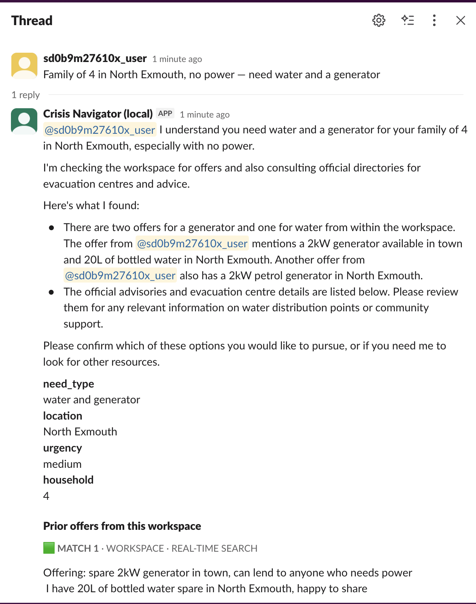
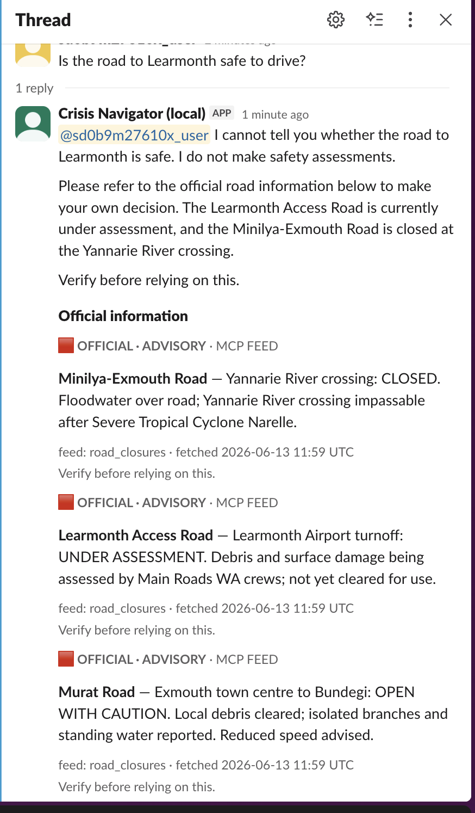
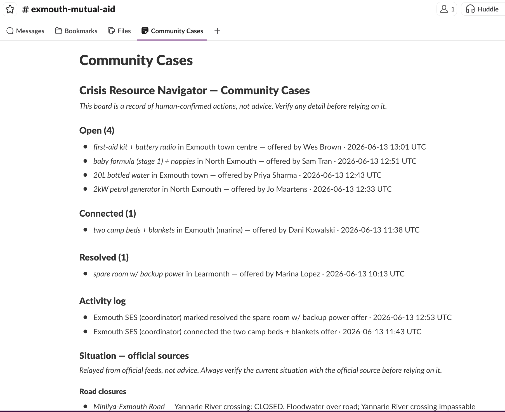
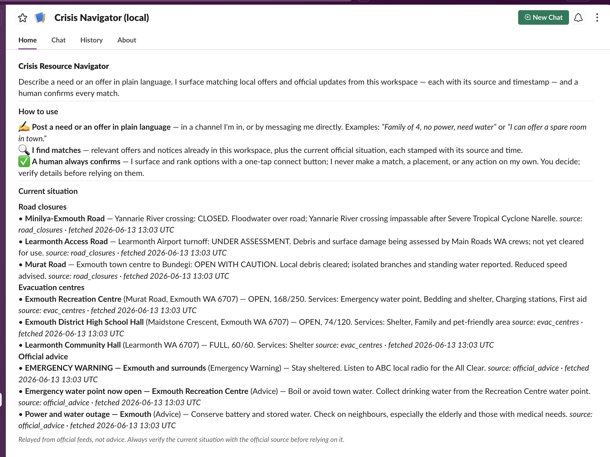
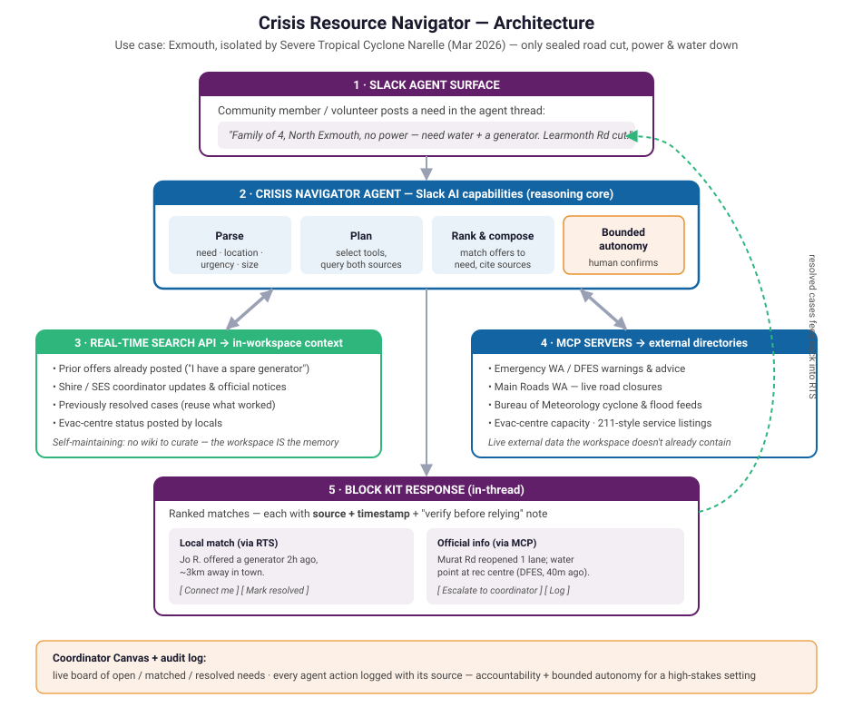

# Crisis Resource Navigator

**A Slack agent that turns a disaster-struck community's chaotic group chat into a coordinated relief operation** — matching needs to nearby offers via Real-Time Search and to official resources via MCP, with a human confirming every match.

*Slack Agent Builder Challenge · "Slack Agent for Good" track.*

> In March 2026, Severe Tropical Cyclone Narelle cut Exmouth, WA off from the world — the only road impassable, power and water down. In an emergency, coordination happens in the chat tool people already use. But offers and needs scroll past each other, official info is scattered, and day-one solutions are re-solved on day three. This agent fixes that.

---

## What it does

A resident or volunteer types a need (or an offer) in plain language, right in the channel. The agent runs a **parse → plan → rank → compose** loop:

1. **Reasons** — parses the message into structured fields (need type, location, urgency, household), and tells a *resource* need ("we need water") from an *information* need ("is the road safe?").
2. **Remembers** — searches the live workspace via the **Real-Time Search API** for relevant prior offers and notices.
3. **Reaches out** — pulls official directories (road closures, evac centres, warnings) through **MCP servers**.

It replies with **one** Block Kit message — the parsed understanding, ranked workspace matches (each stamped who/when), an "Official information" section of sourced cards, and one-tap **Connect / Mark resolved / Not relevant** buttons. A human always confirms the match. Every confirmed action lands on a permanent **Community Cases** coordinator Canvas, and every resolved case feeds back into searchable memory — so the community gets faster at helping itself the longer the crisis runs.

## See it (real Slack screenshots)

| Need → matches + official card | Safety question → refusal + advisory |
|---|---|
|  |  |
| **Coordinator board** | **Branded App Home** |
|  |  |

Interactive walkthrough: [`docs/site/index.html`](docs/site/index.html) (Concept ↔ Live toggle).

## Architecture — three technologies, each load-bearing



| Layer | Technology | Role |
|---|---|---|
| **Reason + interface** | Slack AI — native **agent surface** + a `pydantic-ai` loop | interpret free text, run the loop, stream Block Kit |
| **Memory** | **Real-Time Search API** (`assistant.search.context`) | the workspace *is* the database — no vector store; keyword query + domain re-rank |
| **External reach** | **MCP** — Slack's own MCP server (`mcp.slack.com`) **+** our FastMCP directory servers | official road/evac/advice directories the agent consults in its reasoning loop |

Remove any one and the product breaks. **The MCP integration is real (Slack's server + our own FastMCP servers); the official *data* is simulated static JSON — live Main Roads WA / DFES feeds aren't public, so the wiring is exactly what a real feed would use. We never claim live government data.**

## Safety guardrails (product requirements, pinned by regression tests)

1. **A human decides** — every actionable match ends at a confirmation button, never an automatic action.
2. **Never assert safety** — asked "is the road safe?", the agent refuses to judge and surfaces the official closure status verbatim + a verify note.
3. **Everything is sourced + timestamped** — workspace (who/when) and official items (feed / fetched-at), on screen.
4. **Degraded states are explicit** — a down feed or empty result is stated, never papered over.

## Quickstart

```sh
make install                 # uv sync + git hooks
cp .env.example .env          # add ANTHROPIC_API_KEY (or GOOGLE_VERTEX_API_KEY) + Slack tokens
make run                      # slack run — socket-mode agent against the sandbox
make test                     # full pytest suite (zero warnings)
make seed-demo ARGS=--fresh   # seed the Exmouth scenario
make board                    # open the Community Cases coordinator board
```

Python 3.12+ · `uv` (only package manager) · `ruff` (format + lint) · `pytest`. All dev verbs in the [`Makefile`](Makefile).

## Deploy (always-on for judging)

Socket mode = an outbound worker (no inbound URL). One image, two targets:

```sh
make deploy              # → free GCE e2-micro (default)
make deploy TARGET=fly   # → Fly.io
```

Full guide incl. how the sandbox connects + the one-instance rule: [`deploy/README.md`](deploy/README.md).

## More

- [`crisis_resource_navigator_design_doc.md`](crisis_resource_navigator_design_doc.md) — design + scope (source of truth)
- [`docs/DEVPOST.md`](docs/DEVPOST.md) — submission write-up
- [`crisis_resource_navigator_demo_script.md`](crisis_resource_navigator_demo_script.md) — 3-min video script
- [`docs/adr/`](docs/adr/) — architecture decision records · [`CLAUDE.md`](CLAUDE.md) — working conventions
